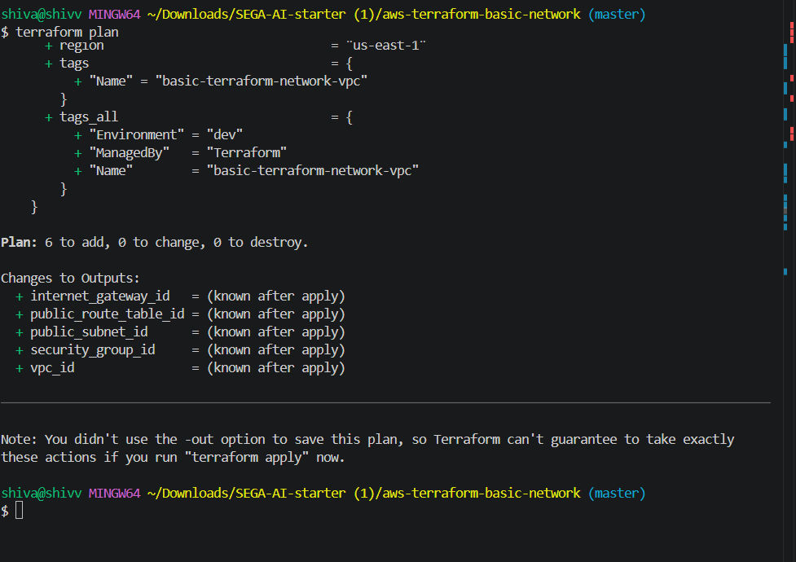
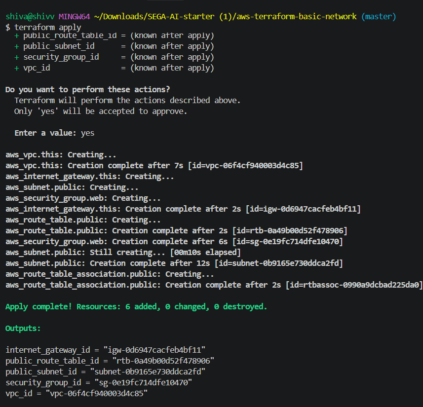

# Basic AWS Network with Terraform

A small Infrastructure as Code project that provisions a basic AWS network using Terraform. It intentionally avoids application servers and other complexity so the focus stays on clean, reusable Terraform fundamentals.

## Architecture

```text
                         Internet
                            |
                    +---------------+
                    | Internet GW    |
                    +-------+-------+
                            |
                 +----------+----------+
                 |         VPC         |
                 |    10.0.0.0/16      |
                 |                     |
                 |  Public Subnet      |
                 |  10.0.1.0/24        |
                 |        |             |
                 |   Public Route      |
                 |      Table           |
                 |        |             |
                 |   Security Group    |
                 |   SSH 22 / HTTP 80  |
                 +---------------------+
```

### Resources

- 1 VPC
- 1 public subnet
- 1 Internet Gateway
- 1 public route table and subnet association
- 1 security group allowing TCP/22 and TCP/80

No EC2 instance is created because the assignment only requires the foundational network resources.

## Project structure

```text
.
├── main.tf
├── variables.tf
├── outputs.tf
├── provider.tf
├── terraform.tfvars.example
├── RESOURCE_SUMMARY.md
├── screenshots/
│   └── README.md
├── .gitignore
└── README.md
```

## Prerequisites

1. Terraform >= 1.6.0
2. An AWS account if you want to apply the configuration
3. AWS credentials configured through the AWS CLI, environment variables, or another supported credential source
4. Git, if you want to publish the project to GitHub

The configuration uses an AWS provider constraint of `>= 5.0, < 7.0`.

## Setup

Clone the repository and enter the project directory:

```bash
git clone <YOUR_GITHUB_REPOSITORY_URL>
cd aws-terraform-basic-network
```

Copy the example variables file:

```bash
cp terraform.tfvars.example terraform.tfvars
```

Edit `terraform.tfvars`. For real usage, restrict `ssh_cidr_blocks` to your own public IP using `/32` instead of leaving SSH open to the internet.

## Initialize

```bash
terraform init
```

## Format and validate

```bash
terraform fmt -recursive
terraform validate
```

## Plan

```bash
terraform plan -out=tfplan
```

Save a screenshot of the successful plan output as:

```text
screenshots/terraform-plan.png
```

<p align="center">
  
</p>

The repository intentionally does not contain a fabricated plan screenshot. Generate it from your own Terraform/AWS environment so the evidence is genuine.

## Apply

If using an AWS Free Tier account:

```bash
terraform apply
```

<p align="center">
  
</p>

Review the proposed resources and type `yes` when prompted.

After a successful apply, capture the terminal output as:

```text
screenshots/terraform-apply.png
```

The infrastructure itself uses VPC networking resources that generally do not incur separate hourly charges, but AWS pricing can change and your account may have other billable resources. Review the AWS pricing page and billing dashboard before applying.

## Outputs

After apply:

```bash
terraform output
```

The configuration returns IDs for the VPC, public subnet, Internet Gateway, route table, and security group.

## Destroy

When the environment is no longer needed:

```bash
terraform destroy
```

## GitHub

Example publication workflow:

```bash
git init
git add .
git commit -m "chore: initialize terraform project"
# add the VPC/subnet files and commit
# add routing/security-group files and commit
# add variables/outputs and commit
# add documentation and commit

git branch -M main
git remote add origin <YOUR_GITHUB_REPOSITORY_URL>
git push -u origin main
```

## Security note

SSH is required by the assignment, but `0.0.0.0/0` is intentionally only a simple default for the lab. Before using this in a real environment, set `ssh_cidr_blocks` to a trusted IP range such as `YOUR_PUBLIC_IP/32`.
